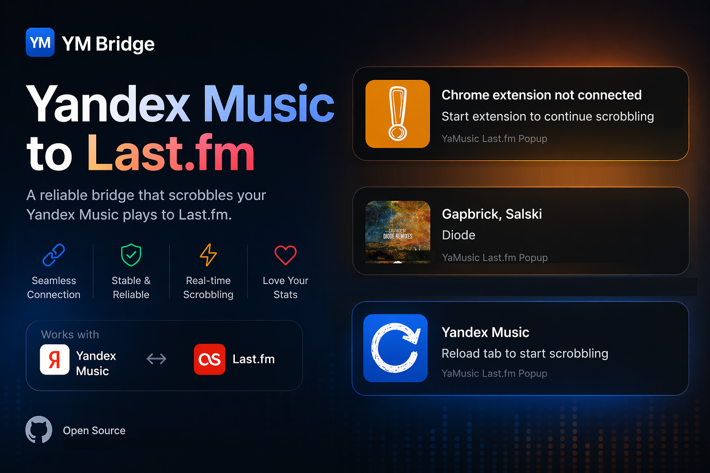

# 🎵 Yandex Music → Last.fm Bridge

Scrobble tracks from Yandex Music to Last.fm — automatically and reliably.

Works via a lightweight browser extension + optional desktop companion for maximum stability.

## Download

- **Desktop app:** GitHub Releases

> Releases: **[Download desktop app](https://github.com/MaratShamsutdinov/yandex_to_lastfm/releases)**

- **Browser extension:** Chrome Web Store

> Extension: **[Download extension](https://chromewebstore.google.com/detail/cjemkikpabifhldcdkopinpejahljcin?utm_source=item-share-cb)**

---

## Preview

<p align="center">
  
</p>

---

## Features

- **Automatic scrobbling** from Yandex Music
- **Instant track detection** (no manual actions)
- **Reliable delivery**
  - queue + retry if something fails
  - no lost scrobbles
- **Smart fallback modes**
  - works with or without desktop app
- **Desktop companion (optional)**
  - enhanced stability
  - background processing
- **Browser extension UI**
  - current track info
  - connection status
  - quick actions (reload / retry / focus)

---

## How it works

```text
Yandex Music (browser)
        ↓
Browser Extension
        ↓
(optional) Desktop Companion
        ↓
Last.fm API
```

The system is designed to handle real-world issues like:

- tab reloads
- temporary network errors
- missed events

---

## Setup

### 1. Install the extension

- Load `ym_bridge_ext` as unpacked extension in Chrome

### 2. (Optional) Run desktop companion

- Build and run the Rust app from `yandex_to_lastfm_rs`

### 3. Configure Last.fm

- Enter your API key, secret, username, and password
- Validate connection

---

## Modes

### Standalone

- Extension sends data directly to Last.fm

### Desktop Companion

- Uses local bridge (`127.0.0.1`)
- More stable and resilient

---

## Notes

- Designed specifically for Yandex Music
- Requires a Last.fm account and API credentials
- Desktop companion is optional but recommended

---

## Tech

- Rust (desktop app)
- Chrome Extension (MV3)
- Local HTTP bridge
- Last.fm API

---

## Status

Actively developed.
Feedback and ideas are welcome.
